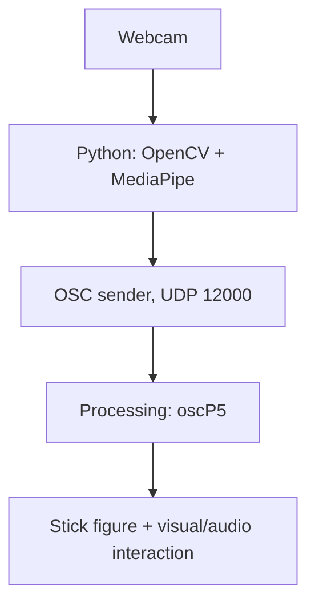

# Architecture

```mermaid
flowchart TD
    A[Webcam] --> B[Python: OpenCV + MediaPipe]
    B --> C[OSC sender, UDP 12000]
    C --> D[Processing: oscP5]
    D --> E[Stick figure + visual/audio interaction]
```
